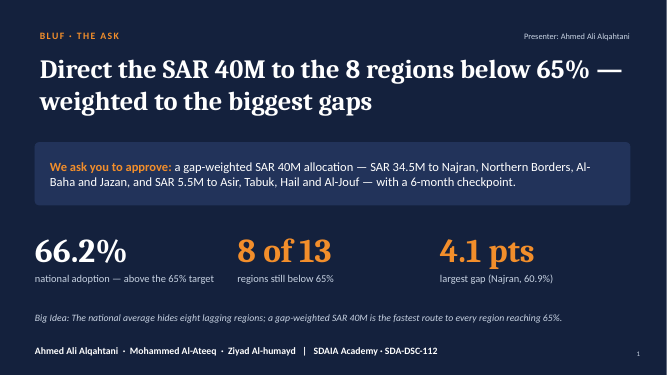
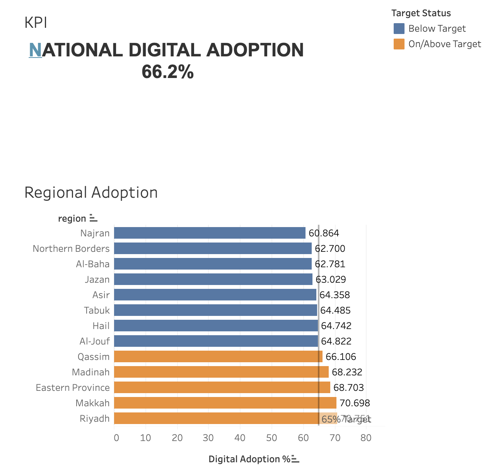

# Tayseer National Digital Adoption — Capstone Project

**SDAIA Academy · SDA-DSC-112 · Data Visualization & Storytelling**

> **Capstone decision:** Where should the next **SAR 40 million** go to lift lagging regions toward the **65% digital-adoption target**?

**Our answer (Big Idea):** The national average hides eight lagging regions; a gap-weighted SAR 40M is the fastest route to every region reaching 65%.

---

## 📊 Tableau Dashboard

**Live dashboard:** [NATIONAL DIGITAL ADOPTION — Tayseer Digital Adoption (Tableau Public)](https://public.tableau.com/views/NATIONALDIGITALADOPTION/TayseerDigitalAdoption?:language=en-US&:display_count=n&:origin=viz_share_link)

The dashboard has two views:

| View | What it shows |
|---|---|
| **KPI** | National digital adoption: **66.2%** — 1.2 pts above the 65% target |
| **Regional Adoption** | Digital adoption % for all 13 regions, sorted, with a 65% target reference line. Blue = below target, orange = on/above target |

**Key numbers from the dashboard**

| Region | Adoption % | Gap to 65% | Status |
|---|---:|---:|---|
| Najran | 60.864 | 4.14 | Below |
| Northern Borders | 62.700 | 2.30 | Below |
| Al-Baha | 62.781 | 2.22 | Below |
| Jazan | 63.029 | 1.97 | Below |
| Asir | 64.358 | 0.64 | Below |
| Tabuk | 64.485 | 0.52 | Below |
| Hail | 64.742 | 0.26 | Below |
| Al-Jouf | 64.822 | 0.18 | Below |
| Qassim | 66.106 | — | On/above |
| Madinah | 68.232 | — | On/above |
| Eastern Province | 68.703 | — | On/above |
| Makkah | 70.698 | — | On/above |
| Riyadh | 70.751 | — | On/above |

---

## 🧭 What we did

1. **Built the evidence in Tableau** — a national KPI and a regional adoption bar chart with a 65% target line and target-status colouring.
2. **Interpreted the evidence** — the country is above target overall (66.2%), but **8 of 13 regions are below 65%**, and four of them (Najran, Northern Borders, Al-Baha, Jazan) hold **87%** of the total 12.2-point gap.
3. **Compared investment options** for the SAR 40M:
   - **A — Spread evenly:** SAR 5M to each below-target region
   - **B — Concentrate on Tier 1:** SAR 10M each to the four deep-gap regions
   - **C — Gap-weighted, two tiers (recommended):** money in proportion to each region's gap
4. **Built a seven-slide executive story** (BLUF → Situation → Complication → Evidence → Options → Recommendation → Ask) with one takeaway title per slide and speaker notes.

### Recommendation

| Tier | Region | SAR (M) |
|---|---|---:|
| Tier 1 — deep gaps | Najran | 13.5 |
| | Northern Borders | 7.5 |
| | Al-Baha | 7.5 |
| | Jazan | 6.0 |
| Tier 2 — near target | Asir | 2.0 |
| | Tabuk | 1.5 |
| | Hail | 1.0 |
| | Al-Jouf | 1.0 |
| **Total** | | **40.0** |

**The Ask:** Approve the gap-weighted SAR 40M allocation, launch within 90 days, and review progress on the same Tableau dashboard at a **6-month checkpoint (April 2027)**.

---

## 🎤 Presentation

| File | Description |
|---|---|
| [`Tayseer_Digital_Adoption_Capstone.pptx`](Tayseer_Digital_Adoption_Capstone.pptx) | Seven-slide deck (with speaker notes) |
| [`Tayseer_Digital_Adoption_Capstone.pdf`](Tayseer_Digital_Adoption_Capstone.pdf) | PDF version |

| # | Slide | Question answered | Presenter | Time |
|---|---|---|---|---|
| 1 | BLUF / Ask | Q3 – Investment priority | Ahmed Ali Alqahtani | 0:00–0:30 |
| 2 | Situation | Q1 – National status | Ahmed Ali Alqahtani | 0:30–1:15 |
| 3 | Complication | Q2 – Regional gap | Mohammed Al-Ateeq | 1:15–2:00 |
| 4 | Evidence | Q2 + Q3 | Mohammed Al-Ateeq | 2:00–4:00 |
| 5 | Options | Q3 – Investment priority | Ziyad Al-humayd | 4:00–5:00 |
| 6 | Recommendation | Q3 – Investment priority | Ziyad Al-humayd | 5:00–6:15 |
| 7 | Ask + Next Step | Q3 – Investment priority | Ziyad Al-humayd | 6:15–7:00 |

---

## 🛠️ Tools & Software

- **Tableau Public** — dashboard and visual analysis
- **Microsoft PowerPoint** — executive presentation
- **GitHub** — project submission and version control

---

## 👥 Team

| Name | Student ID |
|---|---|
| Ahmed Ali Alqahtani | 445102675 |
| Mohammed Al-Ateeq | 445102062 |
| Ziyad Al-humayd | 445102180 |

---

## 🔗 Links

- **Tableau dashboard:** https://public.tableau.com/views/NATIONALDIGITALADOPTION/TayseerDigitalAdoption
- **SDAIA GitHub:** https://github.com/SDAIAAcademy9
